# 超市会员管理系统

## 基本界面

首先是登陆界面

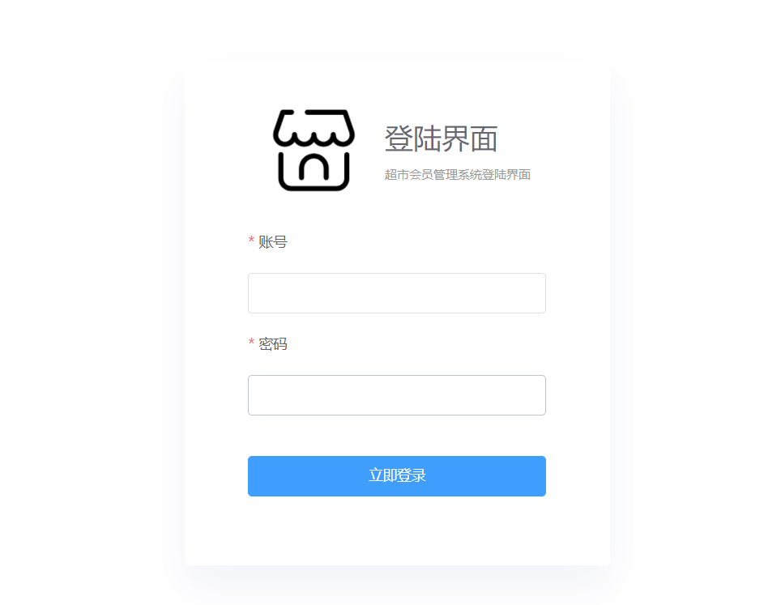

通过会员名单，可以查询出会员名称，会员等级，卡内余额，剩余积分，注册时间，另外可以对其会员信息进行编辑，以及新增并删除会员

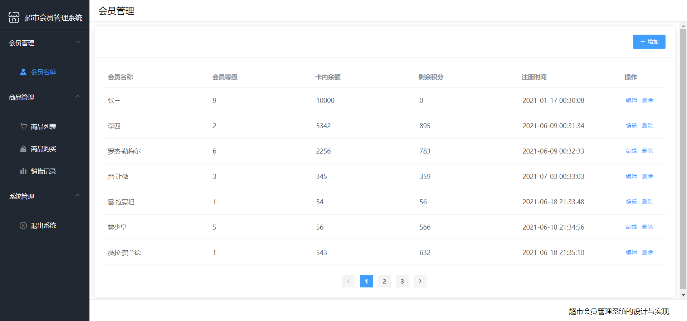


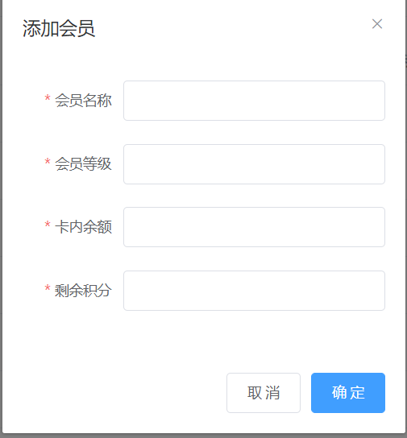

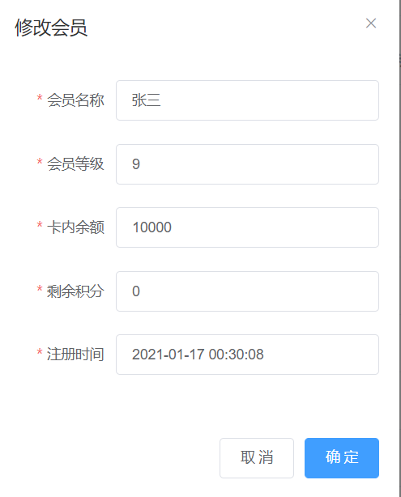

可以查询出商品编号，商品名称，单价，剩余数量，积分规则，并可以对商品信息进行编辑，新增或删除商品

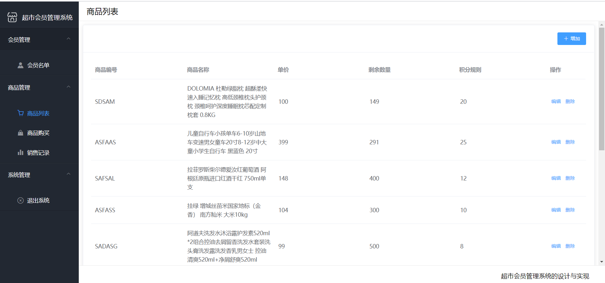

可以选择会员名称，查看会员卡内余额，选择商品数量，自动进行总计花费的计算，提交商品之后，自动在会员名单中扣除对应卡内余额以及增加剩余积分，在商品列表中自动减去剩余数量

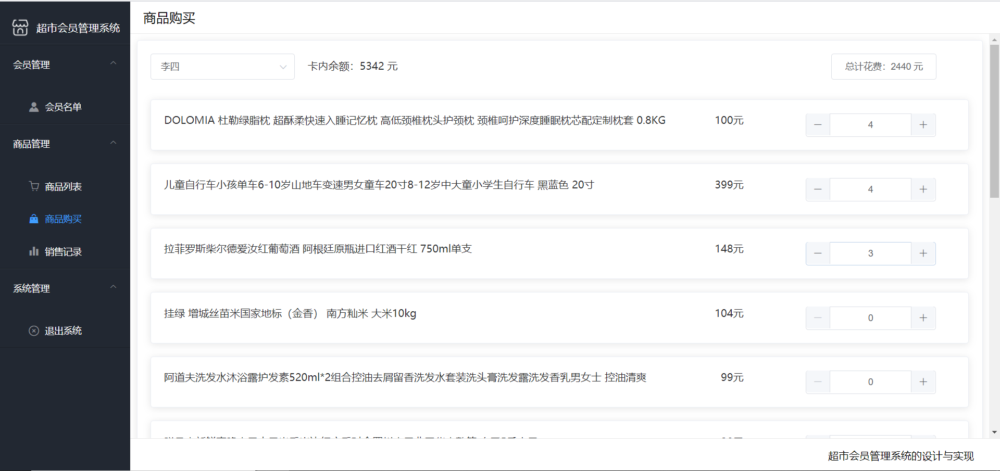

通过商品购买的操作，自动添加会员名称，商品名称，购买数量，以及计算出总计花费多少，当时购买的时间

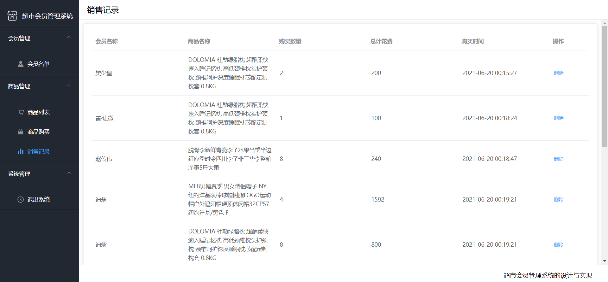


数据库中的表

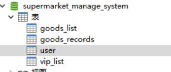


user 登陆数据库

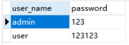

vip_list	vip名单

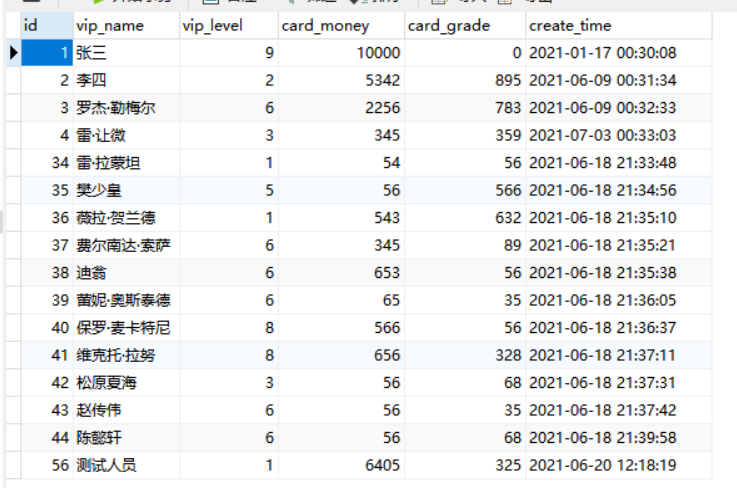

goods_list	商品列表

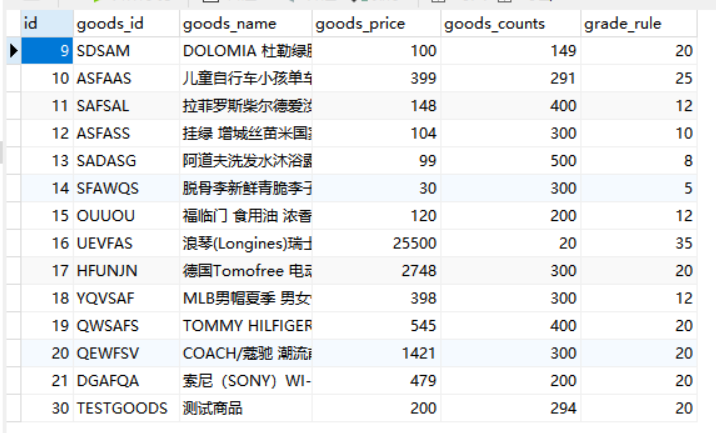

goods_records	商品记录

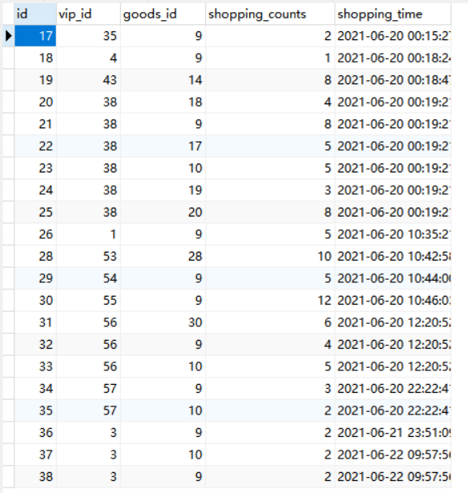

## 使用技术

使用了Vue3、Vite2、Vue router、element-plus、axios 开发前端视图

Vue 是一个用于构建用户界面的框架，其核心特性为数据驱动（MVVM），即页面输入改变数据，数据改变影响页面数据展示与渲染，同时，它可以将各种逻辑均抽象为一个统一的概念（组件）来实现开发的模式，在Vue中每一个.vue文件都可以视为一个组件，而组件化的优势在于低耦合，职责单一，逻辑清晰，可替换，方便调试，可维护。

Vite2 是一种新型前端构建工具，意在提供开箱即用的配置，同时它的 插件 API 和 JavaScript API 带来了高度的可扩展性，并有完整的类型支持。
Vue Router 是 Vue.js 的官方路由。它与 Vue.js 核心深度集成，让用 Vue.js 构建单页应用变得轻而易举。功能包括：嵌套路由映射、动态路由选择、模块化、基于组件的路由配置等

element-plus是一个vue3框架，通过引用特定代码即可实现许多精美的样式
Axios 是一个基于promise网络请求库，作用于node.js和浏览器中，易用、简洁且高效的http库，可以从 node.js 创建 http 请求、拦截请求和响应、转换请求数据和响应数据等


后端使用了 Springboot，并集成Mybatis操作Mybatis

Spring Boot是由Pivotal团队提供的全新框架，其设计目的是用来简化新Spring应用的初始搭建以及开发过程。该框架使用了特定的方式来进行配置，从而使开发人员不再需要定义样板化的配置。

MyBatis 是一款优秀的持久层框架，它支持定制化 SQL、存储过程以及高级映射。MyBatis 避免了几乎所有的 JDBC 代码和手动设置参数以及获取结果集。MyBatis 可以使用简单的 XML 或注解来配置和映射原生信息，将接口和 Java 的 POJOs 映射成数据库中的记录。


数据库方面使用了 Mysql 作为数据库

MySQL是一个关系型数据库管理系统，是目前最流行的关系型数据库管理系统之一

关系数据库将数据保存在不同的表中，而不是将所有数据放在一个大仓库内，这样就增加了速度并提高了灵活性。

MySQL所使用的 SQL 语言是用于访问数据库的最常用标准化语言。MySQL 软件采用了双授权政策，分为社区版和商业版，由于其体积小、速度快、总体拥有成本低，尤其是开放源码这一特点，一般中小型网站的开发都选择 MySQL 作为网站数据库。

## 如何使用

### 数据库

创建名为`supermarket_manage_system`的数据库，运行sql文件

### 后端

在`backend`文件中

修改`application.properties`文件的数据库和用户名密码

后端使用idea运行`SupermarkManageApplication` 的`main`函数

### 前端

在`front`文件中

进入`front`使用

```sh
npm i 
npm run dev
```

运行前端界面

## 参考

[1] 十三 后台管理系统	 github.com/newbee-ltd/vue3-admin

[2] Element-plus 中文文档  https://[element-plus.gitee.io/#/zh-CN/component/installation](https://element-plus.gitee.io/#/zh-CN/component/installation)

[3] Vue3 中文文档 https://vue3js.cn/docs/zh/guide/introduction.html

